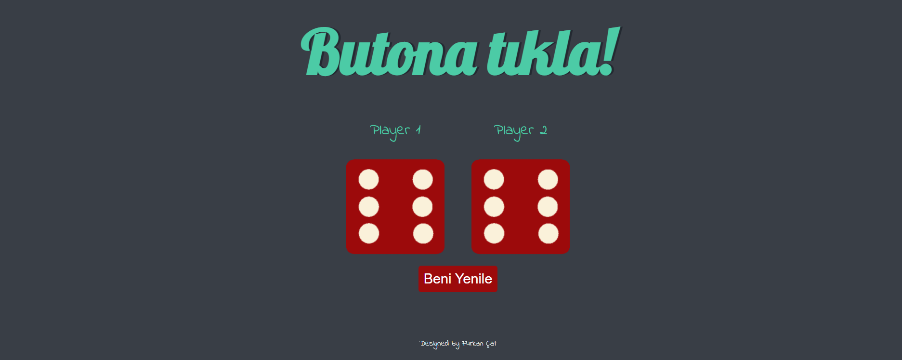

# Dice-app.

<!--
*** Thanks for checking out the Best-README-Template. If you have a suggestion
*** that would make this better, please fork the repo and create a pull request
*** or simply open an issue with the tag "enhancement".
*** Thanks again! Now go create something AMAZING! :D
-->

<!-- PROJECT SHIELDS -->
<!--
*** I'm using markdown "reference style" links for readability.
*** Reference links are enclosed in brackets [ ] instead of parentheses ( ).
*** See the bottom of this document for the declaration of the reference variables
*** for contributors-url, forks-url, etc. This is an optional, concise syntax you may use.
*** https://www.markdownguide.org/basic-syntax/#reference-style-links
-->

[![Contributors][contributors-shield]][contributors-url]
[![Forks][forks-shield]][forks-url]
[![Issues][issues-shield]][issues-url]
[![MIT License][license-shield]][license-url]
[![LinkedIn][linkedin-shield]][linkedin-url]

<!-- TABLE OF CONTENTS -->

  
Table of Contents

  <ol>
    <li>
      <a href="#about-the-project">About The Project</a>
      <ul>
        <li><a href="#game-rules">Game Rules</a></li>
      </ul>
      <ul>
        <li><a href="#additional-rules">Additional Rules</a></li>
      </ul>
      <ul>
        <li><a href="#built-with">Built With</a></li>
      </ul>
    </li>
    <li><a href="#contact">Contact</a></li>
  </ol>

<!-- ABOUT THE PROJECT -->
## About The Project

# GAME RULES

1. The game has 2 players, playing in rounds.
2. In each turn, a player rolls a dice as many times as he wishes. Each result get added to his ROUND score.
3. BUT, if the player rolls a 1, all his ROUND score gets lost. After that, it's the next player's turn.
4. The player can choose to 'Hold', which means that his ROUND score gets added to his GLOBAL score. After that, it's the next player's turn.

## Additional Rules

1. A player looses their ENTIRE score when he rolls two double 6 in row. After that, it's the next player's turn.
2. The player will loose their current score when one of the dice is a 1. After that, it's the next player's turn.
### Built With

##### JavaScript Used
* [Javascipt](https://www.javascript.com/)
* [HTML](https://html.com/)
* [CSS](https://css.com/)

1. DOM Manipulation
2. JavaScript CSS Manipulation
3. addEventListener

<!-- CONTACT -->
## Contact

Furkan Çat - [@FurkanCat](https://twitter.com/FurkanCat) - furi544@gmail.com

Project Link: [Project Link](https://github.com/InsomniumFerum/dice-app)

<!-- MARKDOWN LINKS & IMAGES -->
<!-- https://www.markdownguide.org/basic-syntax/#reference-style-links -->
[contributors-shield]: https://img.shields.io/github/contributors/InsomniumFerum/Best-README-Template.svg?style=for-the-badge
[contributors-url]: https://github.com/InsomniumFerum/Best-README-Template/graphs/contributors
[forks-shield]: https://img.shields.io/github/forks/InsomniumFerum/Best-README-Template.svg?style=for-the-badge
[forks-url]: https://github.com/InsomniumFerum/Best-README-Template/network/members
[stars-shield]: https://img.shields.io/github/stars/InsomniumFerum/Best-README-Template.svg?style=for-the-badge
[stars-url]: https://github.com/InsomniumFerum/Best-README-Template/stargazers
[issues-shield]: https://img.shields.io/github/issues/InsomniumFerum/Best-README-Template.svg?style=for-the-badge
[issues-url]: https://github.com/InsomniumFerum/Best-README-Template/issues
[license-shield]: https://img.shields.io/github/license/InsomniumFerum/Best-README-Template.svg?style=for-the-badge
[license-url]: https://github.com/InsomniumFerum/Best-README-Template/blob/master/LICENSE.txt
[linkedin-shield]: https://img.shields.io/badge/-LinkedIn-black.svg?style=for-the-badge&logo=linkedin&colorB=555
[linkedin-url]: https://www.linkedin.com/in/furkan-%C3%A7at-20174216/
[product-screenshot]: images/project.png
